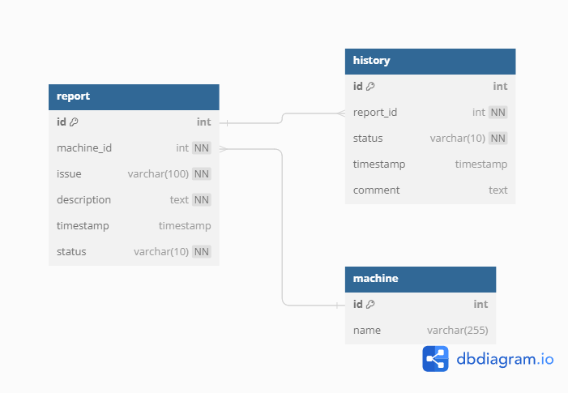

# API Requirements

- [x] Register a machine
- [x] Report an issue
- [x] Retrive all issue reports
  - [x] Implement pagination
- [x] Filter issue reports
- [x] API for Counting Issue Reports Per Machine
  - [x] Implement pagination
- [ ] Count Common Words Across All Issue Titles and Descriptions with Dynamically Specified Top K - I think I can use this [Lesson](https://programminghistorian.org/en/lessons/counting-frequencies) for this task.
- [x] Resolving Issue Reports
- [x] API to retrieve the issue detail - I think maybe I should use `signals` to update the `status` of the issue report when the report is first created.
- [ ] Ensuring Consistency in Issue Report Status Changes

# ER-Diagram


I like to create ER-diagram before starting to code. It helps me to understand the problem better and to think about the solution. I use [dbdiagram.io](https://dbdiagram.io/) to create ER-diagram.

# Frameworks and Libraries

- [Django](https://www.djangoproject.com/)
- [Django REST Framework](https://www.django-rest-framework.org/)
- [Django-filter](https://django-filter.readthedocs.io/en/latest/index.html)
- [mysqlclient](https://pypi.org/project/mysqlclient/)
- [python-dotenv](https://pypi.org/project/python-dotenv/)

# Start the project 

I choose `mysite` to be the project name because it is easy to remember.

## endpoints

I started by specify `the endpoints version` -> `the resource` -> `the action`

- `v1/machine/` for registering a machine
- `v1/machine/num-report/` for counting issue reports per machine
- `v1/report/` for reporting an issue
- `v1/report/<int:pk>/` for retrieving issue detail


## Database and Models

I created a `.env` file inside `mysite` folder to store database credentials. 

```env
DB_NAME=<your_db_name>
DB_USER=<your_db_user>
DB_PASSWORD=<your_db_password>
```

after creating models, I run `python manage.py create_mockup_data` to create mockup data from custom django-admin command that I created.

## Views

I name the views based on the resource name followed by the action name.

## Pagination

I use [Django REST Framework Pagination](https://www.django-rest-framework.org/api-guide/pagination/) to implement pagination. I setup the `DEFAULT_PAGINATION_CLASS` in `settings.py` file to `'rest_framework.pagination.PageNumberPagination'`. I also setup the `PAGE_SIZE` to `2` (for test only) to limit the number of objects per page.